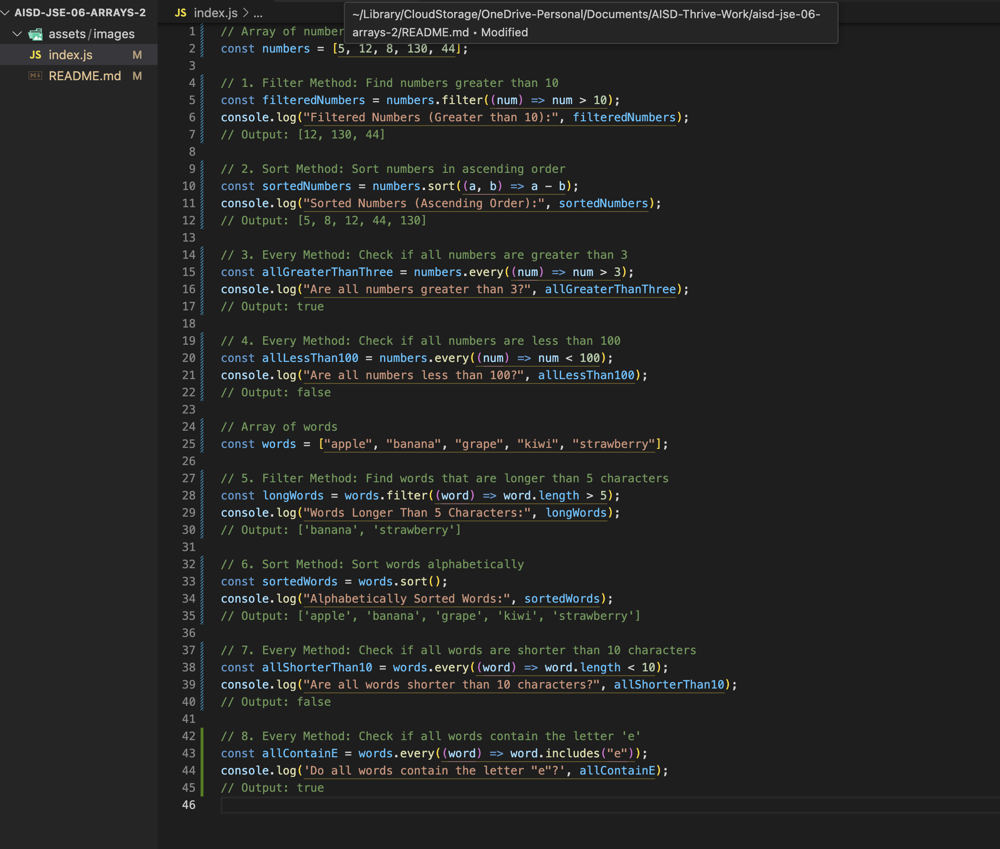

 ### JavaScript Array Iterators and Callback Functions: `filter`, `sort`, and `every`


## Description 📄
In this assignment, you will work with JavaScript array methods like **`filter`**, **`sort`**, and **`every`**. These methods allow you to process arrays efficiently by filtering specific elements, sorting data, and checking if all elements meet certain conditions. You will apply these methods to both a numbers array and a words array. By the end of this assignment, you’ll have a deeper understanding of how to use these methods along with callback functions to manipulate arrays effectively.

## Expected Project Structure 🏗️

Your project should be structured as follows:

```plaintext
array-methods-practice/
   app.js
```

## Instructions ✅

### 1. **Create the Project Folder and File**
Before starting the coding process, ensure your development environment is prepared.

- [ ] Create a project folder named `array-methods-practice` to store your project files.
- [ ] Inside the `array-methods-practice` folder, create a file named `index.js`. This will be your main JavaScript file where all your code will be written.

##

### 2. **Filter Method: Find Numbers Greater Than 10**
In this step, you will use the `filter` method to create a new array that contains numbers greater than 10 from the `numbers` array. The `filter` method takes a callback function that defines the condition for which elements should be included in the new array. If an element meets the condition, it is added to the result.

- [ ] Add the following code to your `index.js` file:

```javascript
// Array of numbers
const numbers = [5, 12, 8, 130, 44];

// Filter numbers greater than 10
const filteredNumbers = numbers.filter((num) => num > 10);
console.log("Filtered Numbers (Greater than 10):", filteredNumbers);  
// Output: [12, 130, 44]
```

- [ ] Run your code using Node.js in the terminal:

```bash
node app.js
```

**Expected Output:**

```bash
Filtered Numbers (Greater than 10): [12, 130, 44]
```

**Explanation:**
- **Iterates Over Each Element:** The `filter` method loops through each element of the `numbers` array and applies the provided condition (`num > 10`) to each element.
- **Only Elements That Meet Condition:** Only elements that meet the condition (in this case, numbers greater than 10) are included in the new array.
- **Returns a New Array:** Unlike methods that mutate the original array, `filter` returns a brand-new array, leaving the original `numbers` array unchanged. This immutability is useful in situations where preserving the original data is critical.

##

### 3. **Sort Method: Sort Numbers in Ascending Order**
In this step, you'll sort the `numbers` array in ascending order using the `sort` method. By default, the `sort` method in JavaScript sorts elements as strings, which may lead to unexpected results when sorting numbers. To fix this, we will provide a custom comparison function `(a, b) => a - b`, which ensures the numbers are sorted correctly from smallest to largest. The `sort` method works by comparing pairs of elements and arranging them based on the return value of the comparison function.

- [ ] Add the following code to your `index.js` file:

```javascript
// Sort numbers in ascending order
const sortedNumbers = numbers.sort((a, b) => a - b);
console.log("Sorted Numbers (Ascending Order):", sortedNumbers);  
// Output: [5, 8, 12, 44, 130]
```

- [ ] Run your code using Node.js in the terminal:

```bash
node app.js
```

**Expected Output:**

```bash
Sorted Numbers (Ascending Order): [5, 8, 12, 44, 130]
```

**Explanation:**
- **Comparison Function:** The comparison function `(a, b) => a - b` ensures numeric sorting. When `a - b` returns a negative value, `a` comes before `b`; a positive result means `b` comes before `a`.
- **Sorting Numbers Correctly:** Without this comparison function, `sort` would treat the numbers as strings (e.g., placing `130` before `12`). The comparison function ensures the numbers are sorted numerically in ascending order.
- **Mutates the Original Array:** The `sort` method modifies the original `numbers` array, so it's important to be aware of this when working with data you want to preserve.

##

### 4. **Every Method: Check If All Numbers Are Greater Than 3**
Next, you will use the `every` method to check if all the numbers in the `numbers` array are greater than 3. The `every` method checks whether all elements in the array satisfy the provided condition. If all elements pass the test, it returns `true`; otherwise, it returns `false`.

- [ ] Add the following code to your `index.js` file:

```javascript
// Check if all numbers are greater than 3
const allGreaterThanThree = numbers.every((num) => num > 3);
console.log("Are all numbers greater than 3?", allGreaterThanThree);  
// Output: true
```

- [ ] Run your code using Node.js in the terminal:

```bash
node app.js
```

**Expected Output:**

```bash
Are all numbers greater than 3? true
```

**Explanation:**
- **Tests Each Element:** The `every` method applies the condition `num > 3` to each element of the `numbers` array.
- **Returns True Only If All Pass:** If every number in the array is greater than 3, it returns `true`. If any number fails the condition, it would return `false`.
- **Common Use Case:** This method is helpful when you need to validate that all elements in an array meet a specific requirement, such as checking user input or form validation in a web app.

##


## 5. **Filter Method: Find Words Longer Than 5 Characters**
Now, let's switch to working with the `words` array. You will use the `filter` method to find all words that are longer than 5 characters. The `filter` method allows you to create a new array containing only words that meet the length requirement.

- [ ] Add the following code to your `index.js` file:

```javascript
// Array of words
const words = ["banana", "strawberry", "kiwi", "grape", "apple"];

// Filter words longer than 5 characters
const longWords = words.filter((word) => word.length > 5);
console.log("Words Longer Than 5 Characters:", longWords);  
// Output: ['banana', 'strawberry']
```

- [ ] Run your code using Node.js in the terminal:

```bash
node index.js
```

**Expected Output:**

```bash
Words Longer Than 5 Characters: ['banana', 'strawberry']
```

**Explanation:**
- **Checks Length of Each Word:** The `filter` method evaluates the length of each word using `word.length > 5`. Words with more than 5 characters are included in the result.
- **Returns New Array:** As with other uses of `filter`, the method creates a new array containing only the words that meet the length condition.
- **Selective Filtering:** This method is particularly useful in applications where you need to extract data based on length, such as filtering search results or displaying specific categories of information.

##

### 6. **Sort Method: Sort Words Alphabetically**
In this step, you will use the `sort` method to sort the words in the `words` array alphabetically. By default, `sort` orders strings in lexicographical (alphabetical) order, so no comparison function is needed here.

- [ ] Add the following code to your `index.js` file:

```javascript
// Sort words alphabetically
const sortedWords = words.sort();
console.log("Alphabetically Sorted Words:", sortedWords);  
// Output: ['apple', 'banana', 'grape', 'kiwi', 'strawberry']
```

- [ ] Run your code using Node.js in the terminal:

```bash
node index.js
```

**Expected Output:**

```bash
Alphabetically Sorted Words: ['apple', 'banana', 'grape', 'kiwi', 'strawberry']
```

**Explanation:**
- **Default Alphabetical Sorting:** The `sort` method, when used with strings, automatically sorts words alphabetically. No custom comparison function is required for strings.
- **Modifies Original Array:** Like with numeric sorting, this method also modifies the original array by placing the words in alphabetical order.
- **Sorting Text Data:** Sorting is commonly used in professional applications for ordering lists of names, categories, or any textual data.

##

### 7. **Every Method: Check If All Words Contain the Letter 'e'**
Finally, you will use the `every` method to check if all words in the `words` array contain the letter 'e'. This method will apply the condition `word.includes('e')` to each word.

- [ ] Add the following code to your `index.js` file:

```javascript
// Check if all words contain the letter 'e'
const allContainE = words.every((word) => word.includes("e"));
console.log('Do all words contain the letter "e"?', allContainE);  
// Output: true
```

- [ ] Run your code using Node.js in the terminal:

```bash
node index.js
```

**Expected Output:**

```bash
Do all words contain the letter "e"? true
```

**Explanation:**
- **String Method Includes:** The `every` method checks whether each word contains the letter 'e' using the string method `includes()`. Since all the words in the array contain 'e', the method returns `true`.
- **Useful for Data Validation:** This approach is valuable when checking for specific patterns or characters in text data, such as validating email addresses or searching for keywords.

##

### 8. **Every Method: Check If All Words Are Shorter Than 10 Characters**
In this final step, you will use the `every` method again to check if all the words in the `words` array are shorter than 10 characters.

- [ ] Add the following code to your `index.js` file:

```javascript
// Check if all words are shorter than 10 characters
const allShorterThan10 = words.every((word) => word.length < 10);
console.log("Are all words shorter than 10 characters?", allShorterThan10);  
// Output: false
```

- [ ] Run your code using Node.js in the terminal:

```bash
node index.js
```

**Expected Output:**

```bash
Are all words shorter than 10 characters? false
```

**Explanation:**
- **Tests Word Length:** The `every` method checks whether each word in the `words` array is shorter than 10 characters.
- **One Word Fails, Result is False:** Since "strawberry" has more than 10 characters, the method returns `false`, as not all words meet the length condition.
- **Efficient Validation:** As with other uses of `every`, the method stops once it finds an element that fails the condition, making it efficient for larger datasets.

##


## Conclusion 📄

In this assignment, you learned how to use JavaScript array methods like **`filter`**, **`sort`**, and **`every`** to manipulate arrays. You worked with both numbers and strings to see how these methods function across different data types. By writing callback functions and using these methods, you now have a solid understanding of how to iterate through arrays, perform operations, and return new results based on specific conditions.

### Key Takeaways:
- **`filter` Method**: Returns a new array with elements that satisfy a given condition. It allows selective extraction of relevant data.
- **`sort` Method**: Sorts array elements, with or without a comparison function, depending on the data type. This is crucial for sorting both numbers and strings correctly.
- **`every` Method**: Returns `true` only if all elements in the array meet a specific condition, making it ideal for validation checks.

### Professional Use:
In real-world, professional scenarios, these array methods are essential tools in JavaScript. They are used across various industries for handling and processing data efficiently. For instance, `filter` is commonly employed to display relevant data (e.g., filtering products based on criteria in e-commerce platforms), `sort` is critical for ranking and ordering items (e.g., sorting user reviews or search results), and `every` is valuable for validation processes (e.g., ensuring that all user input fields are correctly filled before submission).

Understanding how to use these array methods will empower you to work with large datasets, implement dynamic filtering, and ensure data consistency in real-world applications.

##

### Solution codebase 👀
🛑 **Only use this as a reference** 🛑

💾 **Not something to copy and paste** 💾

**Note:**  This lab references a solution file located [here](https://github.com/HackerUSA-CE/aisd-jse-06-arrays-2/tree/solution) (link not shown).


---

© All rights reserved to ThriveDX